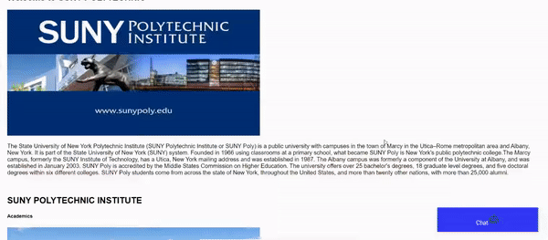

# NLP---Chat-bot
Masters Project - NLP Chat bot for college Enquiry.
# DEMO

# Abstract

 This project focuses on Creating Virtual Query answering system for Colleges. This
System is a Web Application which solves user’s queries from Documents provided by the
admin. Natural language processing which is a branch of Artificial Intelligence has played
major role in this system which helps the computer to understand user’s query. A Chat
bot should be easy to use,fast and accurate to enhance user experience.Reading a catalog
or Searching the website for a small query would waste user’s time where as this Virtual
Assistant would be able to solve the query in seconds. Updating the chat bot will be easy
compared to updating on web page or catalog. Admin would be able to update the document
without any programming knowledge. This project will improve the user experience and will
be available 24/7 to solve queries. 

# Requirments
This code is written in python. Dependencies include:
Python 3
Pytorch (recent version)
NLTK >= 3
Other requirments : 
Click==7.0
Flask==1.1.1
itsdangerous==1.1.0
Jinja2==2.11.1
MarkupSafe==1.1.1
Werkzeug==1.0.0
# Downloads 
Download word vectors
Download GloVe (V1) or fastText (V2) vectors:
<prep>mkdir GloVe
curl -Lo GloVe/glove.840B.300d.zip http://nlp.stanford.edu/data/glove.840B.300d.zip
unzip GloVe/glove.840B.300d.zip -d GloVe/
mkdir fastText
curl -Lo fastText/crawl-300d-2M.vec.zip https://dl.fbaipublicfiles.com/fasttext/vectors-english/crawl-300d-2M.vec.zip
unzip fastText/crawl-300d-2M.vec.zip -d fastText/</prep>
